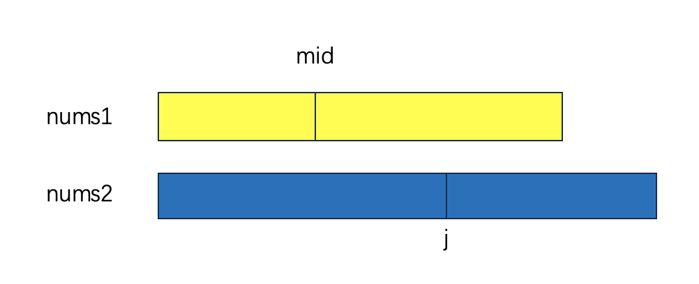

题目链接: [4. 寻找两个正序数组的中位数](https://leetcode.cn/problems/median-of-two-sorted-arrays/)

题目描述

```
给定两个大小分别为 m 和 n 的正序（从小到大）数组 nums1 和 nums2。请你找出并返回这两个正序数组的中位数。

算法的时间复杂度应该为 O(log (m+n)) 。
```

## 拆解子问题与循环不变式

线性遍历只能达到 `O(n)` 的速度, 而题目要求时间复杂度为 `O(log (m+n))`，需要考虑二分的思路。

我们还是先从简单开始, 手动尝试几个示例，找找题目的感觉:
- `nums1 = []`, `nums2 = [1]`, 总数为奇数, 则中位数为 `1`。
- `nums1 = [2]`, `nums2 = []`, 总数为奇数, 则中位数为 `2`, 同时我们注意到这种情况和上面那种情况刚好相反，调换下 `nums1` 和 `nums2` 则是同一种情况。
- `nums1 = [1]`, `nums2 = [2]`, 总数为偶数, 则中位数为 `(1 + 2) / 2 = 1.5`。
- `nums1 = [1, 3]`, `nums2 = [2]`, 总数为奇数, 则中位数为 `2`。
- `nums1 = [2]`, `nums2 = [1, 3]`, 总数为奇数, 则中位数为 `2`。
- `nums1 = [1, 2, 3, 4, 5]`, `nums2 = [6, 7, 8, 9, 10]`, 总数为奇数, 则中位数为 `(5 + 6) / 2 = 5.5`。

稍微思考一下, 我们只考虑 `len(nums1) < len(nums2)`, 相反的情况只需要调换下参数顺序即可。

如何拆解子问题? 当前问题可以用 `nums1[0..n - 1]` 和 `nums2[0..m - 1]` 来表示。我们先考虑总数为奇数的情况。中位数的位置是 `nums1` 和 `nums2`
中间的某个位置，根据中位数的定义，假如这个位置在 `nums1` 中，其前面有 `x` 个数, 那么 `nums2` 中的位置可以由 `y = (n + m + 1) / 2 - x` 得到。
在 `y` 之前的数都小于中位数，之后的数都大于中位数。并且可以看出, `nums1` 前 `x` 个数也小于 `nums2` 后面的数, `nums2` 前 `y` 个数也小于 `nums1`
后面的数。

可以看出, `x` 和 `y` 刚好可以表示子问题, 分别表示两个数组的前多少个数。习惯用 `mid` 表示二分的位置。

如下图所示




我们先尝试取 `nums1` 的中间位置，再比较两个数组中间位置前后的关系。注意，我们用长度来表示范围，而不是下标。
循环不变式: `nums1[0..mid]` 表示 `nums1` 的二分查找范围, `mid` 表示 `nums1` 中间位置, `j` 表示 `nums2` 中间的位置, 则 `j = (n + m + 1) / 2 - mid`。
- 如果 `nums1[mid - 1] > nums2[j]`, 说明 `nums1[mid]` 太大了, 需要左移, 即 `i_max = mid - 1`。
- 如果 `nums1[mid] < nums2[j - 1]`, 说明 `nums1[mid]` 太小了, 需要右移, 即 `i_min = mid + 1`。
- 否则, 说明 `nums1` 的二分查找范围已经为空，跳出循环。

还需要考虑其他情况吗？我们通过之前的分析可以知道，主要是需要比较 `nums1` 和 `nums2` 前后两部分的数的大小，因此上面几种情况就能覆盖所有情况了。

之后我们再来分析跳出循环后应该怎么计算中位数。还是分奇数和偶数来分析, 以及考虑各种边界情况。
- 如果总数是奇数, 由于 `mid + j = (n + m + 1) / 2`, 即合起来第 `mid + j` 个数就是中位数, 则必定是 `nums1[mid - 1]` 和 `nums2[j - 1]`
 中较大的那个, 因为只有这个数才满足是总的第 `mid + j` 个数。如果有一个长度为 `0` 了，则必定是另一个数。
- 如果总数是偶数, 则需要找的中位数是两个。考虑分界点的几个数: `nums1[mid - 1]`, `nums2[j - 1]`, `nums1[mid]`, `nums2[j]`, 一个必定是左边那两个数中的大
的那个数, 另一个必定是右边那两个数中的小的那个数。再结合越界条件判断下边界情况即可。最后返回两个数的均值。


## 代码实现

```python
class Solution:
    def findMedianSortedArrays(self, nums1: List[int], nums2: List[int]) -> float:
        """
        二分查找。
        """
        n = len(nums1)
        m = len(nums2)

        if n > m:
            return self.findMedianSortedArrays(nums2, nums1)

        # 假如找到中位数，那么应该分别在 nums1 和 nums2 中有左半边。nums1 的右端点小于 nums2 的右半边的第一个数，
        # 且 nums2 的右端点小于 nums1 的右半边的第一个数。否则，继续在 nums1 中二分。
        i_min, i_max = 0, n
        mid = (i_min + i_max) // 2

        half_len = (n + m + 1) // 2
        j = half_len - mid

        # i_min, i_max 是 nums1 的二分查找范围。
        # half_len 是 nums1 和 nums2 的左半边的总长度。
        # mid 是 nums1 左半边的长度，j 是 nums2 左半边的长度。
        while i_min <= i_max:
            mid = (i_min + i_max) // 2
            # j 是 nums2 的二分查找范围。
            j = half_len - mid

            # 比较 nums1 和 nums2 的左半边右端点和右半边的左端点。
            # 如果右端点都大于左端点，则说明找到了。否则，继续二分。
            if mid > 0 and nums2[j] < nums1[mid - 1]:
                i_max = mid - 1
            elif mid < n and j - 1 >= 0 and j - 1 < m and nums1[mid] < nums2[j - 1]:
                i_min = mid + 1
            else:
                break

        if (n + m) % 2 == 1:
            if mid - 1 >= 0 and j - 1 >= 0:
                return max(nums1[mid - 1], nums2[j - 1])
            elif mid - 1 >= 0:
                return nums1[mid - 1]
            else:
                return nums2[j - 1]
        else:
            x = 0
            y = 0

            if mid - 1 >= 0 and j - 1 >= 0:
                x = max(nums1[mid - 1], nums2[j - 1])
            elif mid - 1 >= 0:
                x = nums1[mid - 1]
            else:
                x = nums2[j - 1]

            if mid < n and j < m:
                y = min(nums1[mid], nums2[j])
            elif mid < n:
                y = nums1[mid]
            else:
                y = nums2[j]

            return (x + y) / 2
```