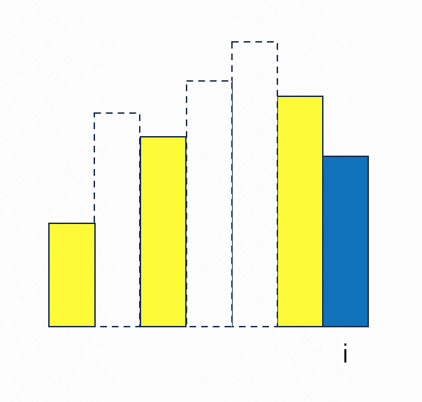

题目链接: [84. 柱状图中最大的矩形](https://leetcode.cn/problems/largest-rectangle-in-histogram/description/)

题目描述:

```
给一个柱状体高度列表，求柱状体组成的矩形中面积最大的矩形。
```

## 拆解子问题与循环不变式

我们首先手动尝试几个示例找找这个题目的感觉，一般是从简单的入手，逐渐增加难度:
- 如果只有一个柱子，如 `[1]`，那么显然最大矩形就是这个柱子。
- 如果有两个柱子，如 `[1, 2]`，那么两个柱子共同形成的矩形的高就是较矮的那个柱子, 然后和高的那个柱子面积比较即可。
- 如果是三个柱子，则情况稍微复杂些:
  - 如果是中间的柱子矮，如 `[2, 1, 3]`，则这根柱子可以和两边形成矩形，然后和两边单独形成的矩形比较。
  - 如果是中间的柱子最高，如 `[2, 3, 1]`，则中间的柱子可以分别和两边的柱子形成矩形，再和单独的柱子比较。
  - 如果是单调递增的柱子，如 `[1, 2, 3]`，则每个柱子都可以和其右边的其他柱子形成矩形，高是当前柱子，宽是当前柱子到右边柱子的距离。
  - 如果是单调递减的柱子，如 `[3, 2, 1]`，则类似上述递增的情况。
- 如果是更多的柱子，则需要再思考。

此时我们大概对题目有些感觉了，观察上面分析的几种情况，我们发现组成矩形的柱子的高都是一些有特点的柱子, 如果我们能
利用这些特点来遍历每个柱子，计算以当前柱子为高形成的最大矩形，则可以求得最大矩形。

我们需要想办法利用这些特点，来减小问题的规模。题目给了一个数组，减小数组规模的常见思路有线性遍历(每次将问题规模减小1)、
二分、从两边往中间缩小等。

### 方案一: 二分

我们首先看第一个特点，最矮的柱子形成的最大矩形其宽度是整个列表的宽度。我们试试和二分结合起来。假如我们以列表中最小的柱子
将列表分成左右两部分，我们观察到左右两部分的矩形也不会有重合, 则左右不分分别对应两个子问题，都有一个最大的矩形。
因此整个列表的最大矩形只可能是以下三者之一:
- 左边部分的最大矩形
- 右边部分的最大矩形
- 当前最小的柱子形成的最大矩形。

我们可以根据此思路递归的求解。这个算法的复杂度是 `O(nlogn)`。这个算法是对的，只不过会超时。

### 方案二: 线性遍历

我们再思考有没有更快的解法。

观察第二个特点，对于单调递减的柱子，每个柱子形成的矩形其有边界一定是最左边的柱子。如果不是单调递减的柱子，我们能找到其
最大矩形最左边的边界吗？假如能找到，我们就可以类似的找右边界，这样每个柱子对应的最大矩形就找到了。这不禁给了我们第二个
思路，对于每个柱子，寻找其最大矩形的左右边界, 然后所有矩形里取最大值则是答案。

我们先考虑如何找左边界。仔细思考一下，左边界即是当前柱子左边第一个比他小的柱子右边紧挨的柱子。我们还是用之前的思路，先
不关心如何找到，先假设子问题已经解决，即左边第一个比当前柱子小的位置已经知道。

循环不变式: `left[i]` 表示 `heights` 中小于 `i` 的位置中第一个小于 `heights[i]` 的位置。
现在考虑位置 `i` 与之前的位置的关系， 来求解 `left[i]`。
- 假如 `heights[i]` 大于 `heights[i - 1]`，则 `left[i] = left[i - 1]`。
- 假如 `heights[i]` 小于等于 `heights[i - 1]`，我们观察 `left[i - 1] + 1` 到 `i - 1` 之间的柱子都大于等于
  `heights[i - 1]`，那么这些柱子一定也大于等于 `heights[i]`。
  如下图所示, 因此我们还需要继续找 `left[i - 1]` 左边第一个小于 `heights[i]` 的位置。这个问题恰好类似刚才那个问题，
  我们可以递归的再往前找，最终找到满足条件的 `left[i]`。

  我们仔细观察下图可以发现，对于 `left[i - 1]`, 其右边第一个下于 `heights[left[i - 1]]` 的柱子恰好是 `heights[i]`。
  即我们可以同时找到右边界。

  

按以上的思路就可以得到第二个解法，分别用 `left` 和 `right` 数组标记每个柱子的左右边界，然后遍历每个柱子，求其最大矩形，再
取最大值即可。

### 方案三: 单调栈

观察方案二的示意图，我们还发现一个特点，对于每个柱子左侧寻找边界时的序列是一个递增的序列，这个序列只需要 `i - 1` 位置对应的，
因此我们可以考虑用一个栈来保存这些序列，每次遍历的时候更新这个栈即可。这样就得到了我们的第三个方案。

## 代码实现

方案三代码实现如下

```python
class Solution:
    def largestRectangleArea(self, heights: List[int]) -> int:
        n = len(heights)
        if n == 0:
            return 0
        
        left_arr = [0 for i in range(n)]
        right_arr = [n - 1 for i in range(n)]

        stack = [0]
        for i in range(1, n):
            while len(stack) > 0 and heights[stack[-1]] >= heights[i]:
                right_arr[stack[-1]] = i - 1
                stack.pop()

            if len(stack) > 0:
                left_arr[i] = stack[-1] + 1
            else:
                left_arr[i] = 0

            stack.append(i)

        max_area = 0
        for i in range(n):
            max_area = max(max_area, heights[i] * (right_arr[i] - left_arr[i] + 1))

        return max_area
```
